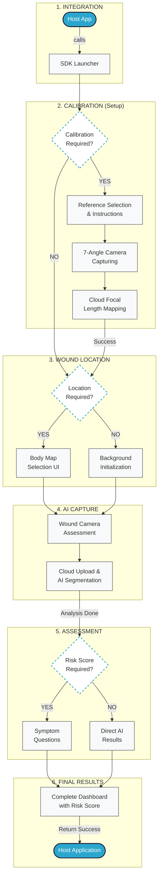

## 🔄 SDK Workflow Diagram



---

## 📱 Screen-by-Screen Breakdown

---

## 📱 Screen-by-Screen Breakdown

### 1. Calibration Flow (Setup)
*   **Calibration Instructions**: Guides the user on selecting a coin (reference object) and explains the 7-angle photography process required to map the device's camera focus distance.
*   **Calibration Camera**: A specialized camera interface that tracks progress through 7 specific shots. It ensures the device is held "flat" (parallel to the ground) using the gyroscope.
*   **Calibration Review**: Displays the captured reference photos and sends them to the Auxillium Cloud for focal length mapping. Success triggers saving the data locally so the user doesn't have to calibrate again.

### 2. Wound Assessment Flow
*   **Body Map (Wound Location)**: *[Conditional]* If `woundLocationRequired` is true, a 3D-style body map appears. Users select the anatomical region (e.g., Lower Leg) to provide context for the AI.
*   **Wound Camera**: The primary capture interface.
    *   **Flatness Indicator**: A real-time level that turns green when the phone is perfectly parallel to the wound.
    *   **Auto-Focus**: Optimized for close-range wound photography.
    *   **Preview & Confirm**: Users can review the photo for clarity before uploading.
*   **AI Analysis (Processing)**: A transition screen showing upload progress. The Auxillium AI segments the wound and identifies tissue types in the background.

### 3. Assessment & Results
*   **Clinical Assessment**: *[Conditional]* If `woundScoreRequired` is true, the user answers a series of validated clinical questions about the wound (e.g., exudate, odor).
*   **Final Results Dashboard**:
    *   **Tissue Analysis**: Interactive pie charts showing percentages of Granulation, Slough, and Eschar.
    *   **Peri-wound Analysis**: Detection of Maceration, Erythema, and Callus.
    *   **AI Overlays**: Multi-layered images showing exactly where the AI "sees" different tissue types.
    *   **Measurements**: Precise Length, Width, and Area calculated based on calibration data.
    *   **Risk Score**: A synchronized 🔴🟡🟢 indicator summarizing the wound's severity.

### 4. Adjustments & History
*   **Manual Measurement Edit**: Allows clinicians to manually adjust the length/width markers or area lasso if they want to override the AI's automatically detected border.
*   **Wound History**: A chronological list of all previous assessments for that specific patient, allowing for visual and data-driven tracking of the healing journey.

---

## 🚩 Parameter Explanation

The following parameters passed to `woundtissueclassificationWithLauncher` control the workflow:

| Parameter | Type | Description |
| :--- | :--- | :--- |
| `calibrationRequired` | `Boolean` | If `true`, forces the coin calibration process. If `false`, skips to wound assessment. |
| `woundLocationRequired`| `Boolean` | If `true`, shows the body map UI to select wound location. If `false`, ignores the map. |
| `woundScoreRequired` | `Boolean` | If `true`, asks clinical questions and shows the 🔴🟡🟢 Risk Score. If `false`, only shows tissue analysis. |
| `primaryColor` | `String` | Hex code (e.g., `"#2CA6CC"`) applied to buttons, status bar, and toolbars. |

## 🛠 Integration Example

```java
woundtissueclassification.woundtissueclassificationWithLauncher(
    launcher, 
    context, 
    "user_id", 
    "wound_id", 
    BuildConfig.SDK_TOKEN, 
    "#2CA6CC", 
    true,  // riskScore
    false, // body selection
    true   // calibration
);
```
